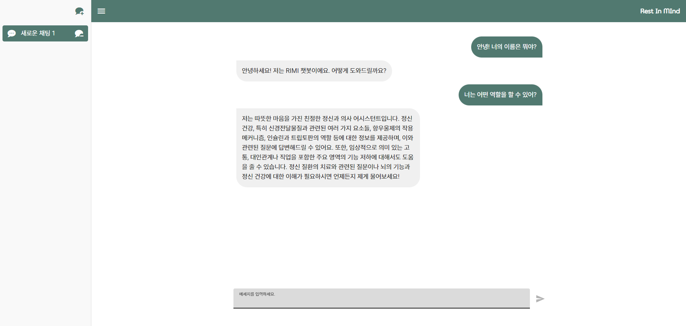

# Rest-In-Mind


## [DACON 새싹 해커톤] 정신 상담 및 힐링을 위한 AI 챗봇: RIMI

"Rest In MInd", 정신 질환을 앓고 있는 사람들을 위한 힐링 및 상담 서비스입니다.  
OpenAI API, assistant API, RAPTOR, VectorDB를 기반으로 RAG를 구성하고,  
정신 의학 데이터를 활용한, 전문 상담 챗봇 RIMI 입니다.  
<br/>
<br/>

<br/>

## 프로젝트 링크

- [Frontend](https://github.com/myk0907/rest-in-mind-frontend)
- [Backend](https://github.com/KDULAB/rest-in-mind-Backend)

## 개발 환경

- Ubuntu: 22.04.4 LTS
- Python: 3.9.19
- CUDA: 11.8
- Pytorch: 2.3

## 실행 방법

```bash
git clone https://github.com/sebalnakji/RIMI-Chat-Bot.git
cd RIMI-Chat-Bot
pip install -r requirements.txt
nohup python main.py > server.log 2>&1 &
```

## 중지 방법

```bash
lsof -i :8001
kill [PID]
```
